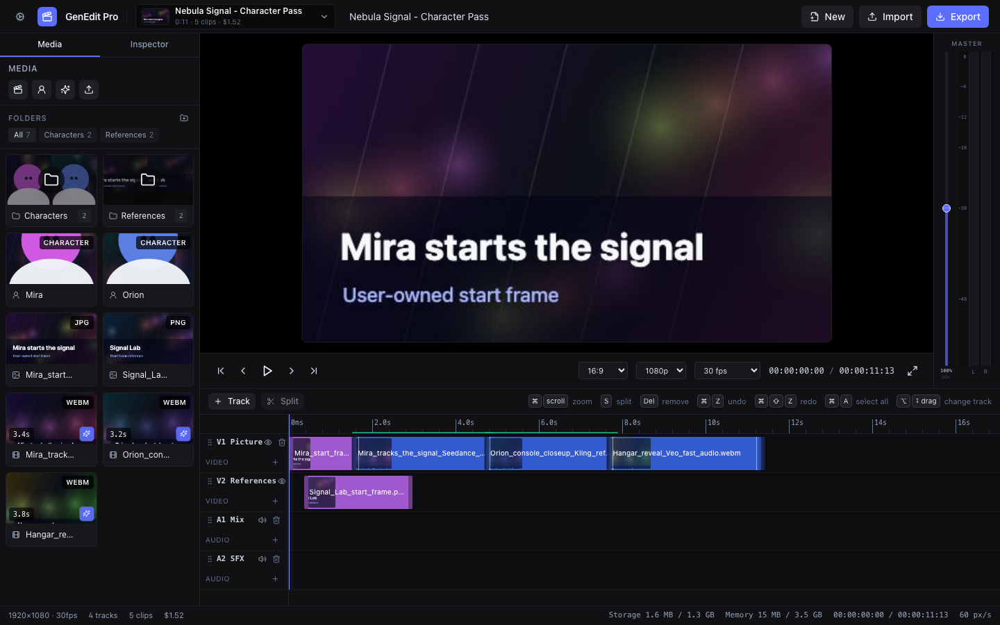
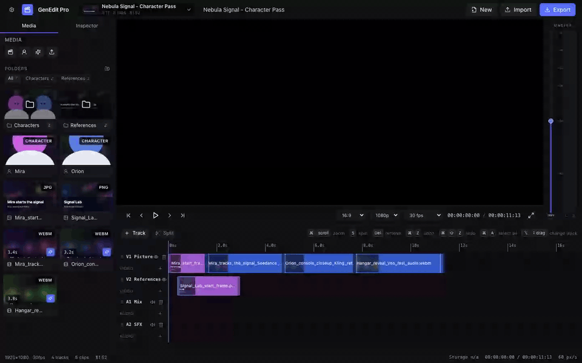
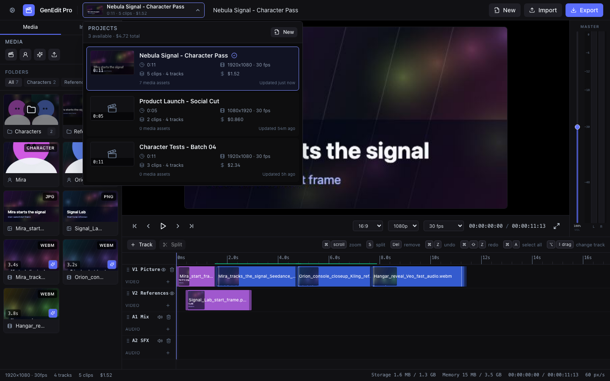
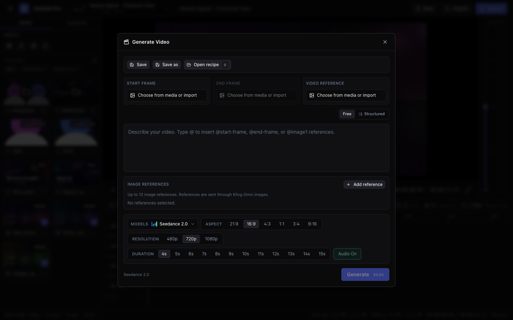

<div align="center">
  <h1>GenEdit Pro</h1>
  <p><strong>Open-source, browser-first AI video editing for creators who want to own the whole pipeline.</strong></p>

  <p>
    <a href="https://github.com/sollaholla/genedit-pro/actions/workflows/deploy.yml"></a>
    
    
    
    
  </p>

  <p>
    
    
    
    
  </p>

  <p>
    <a href="https://sollaholla.github.io/genedit-pro/"><strong>Open the app</strong></a>
    |
    <a href="#development">Run locally</a>
    |
    <a href="#cost-aware-ai-generation">AI costs</a>
  </p>
</div>



## What It Is

GenEdit Pro is a non-linear video editor that runs in the browser and treats AI generation as part of the edit, not a separate black-box workflow. Import your own media, build multi-track timelines, create reusable character references, generate model clips, track spend per project, and export without handing your whole project library to a hosted editing platform.

The editor itself is open source. You bring your own provider key for generation, so your money goes to the model output you choose instead of another closed creative-suite subscription.



## Highlights

- Browser-first editing surface with media bin, preview monitor, multi-track timeline, transport controls, master bus meters, and export workflow.
- Local project storage: project JSON in `localStorage`, media blobs in IndexedDB, and no GenEdit cloud account required to edit.
- AI video generation through PiAPI-backed models including Seedance 2.0, Kling 3.0 Omni, and Veo 3.1 variants.
- Character/reference workflow for reusable visual identity, image references, start/end frames, source video references, and prompt tokens.
- Professional project picker with thumbnails, duration, clip count, format, frame rate, last update time, and tracked generation spend.
- Keyframed timeline controls for motion and clip parameters, plus split, trim, snapping, selection, track visibility, and mute controls.
- In-browser MP4 export through FFmpeg with H.264/AAC output.

## Screenshots

<p align="center">
  
  
</p>

The captures above were taken from the running app in a browser automation session using demo project media. Real provider output depends on your PiAPI account, the selected model, and the references you choose to send.

## User-Owned Content

GenEdit Pro is designed so the editor does not become the gatekeeper of your work.

- Your imported source media is stored in your browser's IndexedDB for the active origin.
- Your project structure is local JSON, not a remote database owned by the app.
- API keys are encrypted in-browser with Web Crypto before being stored locally.
- Generated provider outputs are downloaded back into the media bin as regular project assets.
- When a model needs remote references, only the selected references are sent through the provider/temporary hosting path required for that generation.

## Cost-Aware AI Generation

The generation modal estimates cost before dispatch and project summaries roll completed generation spend into the project browser. Pricing changes over time, but the app currently uses these PiAPI estimate rates:

| Model | Typical inputs | Estimate logic in app |
| --- | --- | --- |
| Seedance 2.0 Fast | Prompt, frames, references | 480p `$0.08/s`, 720p `$0.16/s` |
| Seedance 2.0 | Prompt, frames, references | 480p `$0.10/s`, 720p `$0.20/s`, 1080p `$0.50/s` |
| Kling 3.0 Omni | Prompt plus image/video references | 720p `$0.10/s` silent or `$0.15/s` audio; 1080p `$0.15/s` silent or `$0.20/s` audio |
| Veo 3.1 Fast | Prompt, frames, audio option | `$0.06/s` silent or `$0.09/s` audio |
| Veo 3.1 | Prompt, frames, audio option | `$0.12/s` silent or `$0.24/s` audio |

A five-second 720p Seedance Fast test estimates at `$0.80`; a five-second silent Veo Fast test estimates at `$0.30`. That kind of up-front visibility makes it easier to iterate deliberately instead of discovering the bill after a batch run.

## Stack

- Vite 5, React 18, TypeScript 5.6
- Tailwind CSS for the editor UI
- Zustand for project, media, playback, and export state
- IndexedDB via `idb` for media blobs
- `@ffmpeg/ffmpeg` for in-browser MP4 export
- Playwright for browser automation and capture workflows
- Lucide React icons throughout the interface

## Development

```bash
npm install
npm run dev          # http://localhost:5173/genedit-pro/
npm run typecheck    # tsc --noEmit
npm run build        # type-check + production build
npm run preview      # preview the production build
npm run lint         # eslint
```

The dev and preview servers set `Cross-Origin-Opener-Policy` and `Cross-Origin-Embedder-Policy` headers so FFmpeg can use browser features that require cross-origin isolation.

## Deployment

GitHub Pages deployment is handled by `.github/workflows/deploy.yml`. The workflow installs dependencies, runs `npm run build`, uploads `dist`, and publishes the app with `VITE_BASE=/genedit-pro/`.

One-time GitHub setup: go to **Settings -> Pages -> Build and deployment -> Source: GitHub Actions**. After that, pushes to `main` publish the latest build.

## Project Status

GenEdit Pro already has the core editing loop, local media persistence, PiAPI generation UI, character/reference management, cost tracking, and export path in place. The next frontier is deeper compositing, richer effects, more provider choices, and broader automated coverage as the editor surface settles.

## License

GenEdit Pro is licensed under the GNU General Public License v3.0. See [LICENSE](LICENSE) for the full license text.
